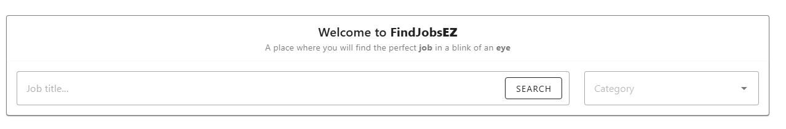
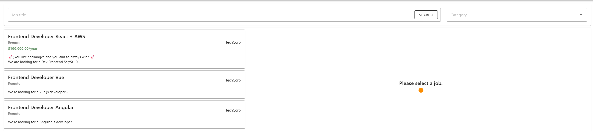
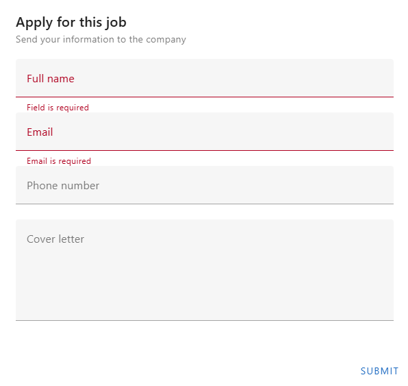

# 📘 Project documentation: Job List Application



## 📌 Introducción

### This project is an application created with Vue3 and Vite, using Vuetify for design user interface. This App allows people to search for new jobs and allow them to apply to a job. Project is also responsive.

## 🚀 Project Configuration

### 📂 Instalation and configuration

To run this code in local, follow these steps:

1. Clone the repository:

```sh
git clone https://github.com/ekalblake/job-list-application.git
cd job-list-application
```

2. Install dependencies:

```sh
npm install
```

3. Start the development server:

```sh
npm run dev
```

## Project Setup extra

### Run Unit Tests with [Vitest](https://vitest.dev/)

```sh
npm run test:unit
```

### Lint with [ESLint](https://eslint.org/)

```sh
npm run lint
```

## Project Steps

You will be able to find jobs with: Job title, company name, location and category


If you dont put any value, it will display all job list, but if you type for example "Frontend" it will display only those matches.



Once you find a job that fits your profile, you can submit an application with:

- Full name (required)
- Email (required)
- Phone number
- Cover letter


